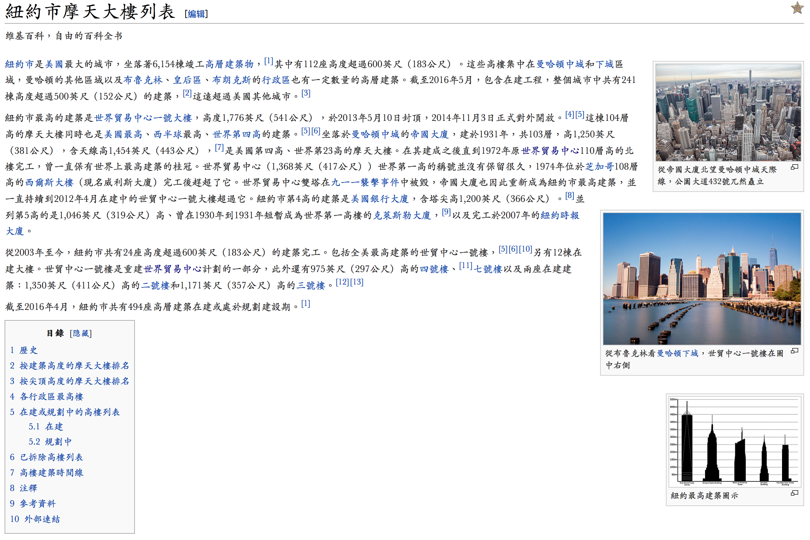

# Classic
This is a “Classic” style for skin Vector. Baskerville is one of the most adopted, and most graceful serif typeface originated in England. This style is based on Baskerville. However if you do not have Baskerville installed in your computer, this style will render Western characters into Georgia, which is also a wide-spread typeface, and also equipped in both Windows and OS X.

本样式针对 Vector 皮肤力图“经典”，Baskerville 是一个具有英式风格的极具优雅美感的字体，同事也是最常用的字体之一。本样式即基于 Baskerville。当然，如果你的电脑并没有安装 Baskerville，本样式将会渲染回退字体 Georgia, 同样也是一款非常常用的字体，在 Windows 和 macOS (OS X) 中都是自带字体。

## CJK / 泛汉字圈字体
In the pan-CJK side, this style adopted Songti SC (By Changzhou SinoType) in Simplified Chinese, which is match to Baskerville, for OS X. While SimSun series for Windows. However for Japanese, the default Japanese font will be Hiragino Mincho Pro in OS X, and MS PMincho, MS Mincho for Windows. Also I set several fallback fonts for Japanese since most of Japanese fonts do not covered all CJK fonts.

在泛汉字圈字体中，本样式为简体中文采用了华文宋体，该字体与 Baskerville 非常搭配，同时 OS X 也包含此字体；而中易宋体系列则为 Windows 而准备。日文方面，默认的日语字体为冬青明朝（OS X）以及 MS 明朝系列 （Windows），同时因日文字体通常不包含所有汉字，针对日文也做了回退设计。

## Standard of Chinese for Different Regions / 不同地区汉字的标准
This style supports Japanese, Simplified Chinese, Traditional Chinese (Hong Kong), Traditional Chinese (Taiwan).

本样式支持日文、简体中文、繁体中文（香港）、繁体中文（台湾）。

### Simplified Chinese / 简体中文
This style adopted Songti SC (By Changzhou SinoType) for Simplified Chinese for macOS (OS X), while SimSun series for Windows.

本样式采用华文宋体（简体）为 macOS (OS X) 中的默认简体中文字体，对于 Windows 则是中易宋体。

### Traditional Chinese (Taiwan) / 繁体中文（台湾）
This style adopted Kaiti TC(By Changzhou SinoType) for Traditional Chinese (Taiwan) for macOS (OS X) while MingLIU series for Windows.

本样式采用华文楷体（繁体）为 macOS (OS X) 中的默认繁体中文（台湾）字体，对于 Windows 则是新细明体。

### Japanese / 日文
This style adopted Hiragino Mincho Pro for Japanese for macOS (OS X), while MS PMincho and MS Mincho series for Windows. Also I set several fallback fonts for Japanese since most of Japanese fonts do not covered all CJK fonts.

本样式采用 Hiragino Mincho Pro 为 macOS (OS X) 中的默认日文字体，对于 Windows 则是 MS PMincho 和 MS Mincho。因日文字体通常不包含所有汉字，针对日文也做了回退设计。

## Styles / 样式
- [Classic_zh_CN_Vector.css](Classic_zh_CN_Vector.css)  
  This style is designed for skin “Vector” of Simplified Chinese Wikipedia.  
  用于简体中文版本的维基百科皮肤 “Vector”。  
  __Example / 示例__  
  
- [Classic_zh_TW_Vector.css](Classic_zh_TW_Vector.css)  
  This style is designed for skin “Vector” of Traditional Chinese (Taiwan) Wikipedia.  
  用于繁体中文（台湾）版本的维基百科皮肤 “Vector”。  
  __Example / 示例__  
  
- [Classic_JP_Vector.css](Classic_JP_Vector.css)    
  This style is designed for skin “Vector” of Japanese Wikipedia.  
  用于日文版本的维基百科皮肤 “Vector”。  
  __Example / 示例__  
  

  __All examples are captured in Safari 8.0.8 on OS X Yosemite 10.10.5, except example for Traditional Chinese(Taiwan) is captured in Safari 10.0 on macOS Sierra.__  
  __除繁体中文（台湾）截取自运行在 macOS Sierra 的 Safari 10.0 之外，其他示例都截取自运行在 OS X Yosemite 10.10.5 的 Safari 8.0.8。__

  ​
