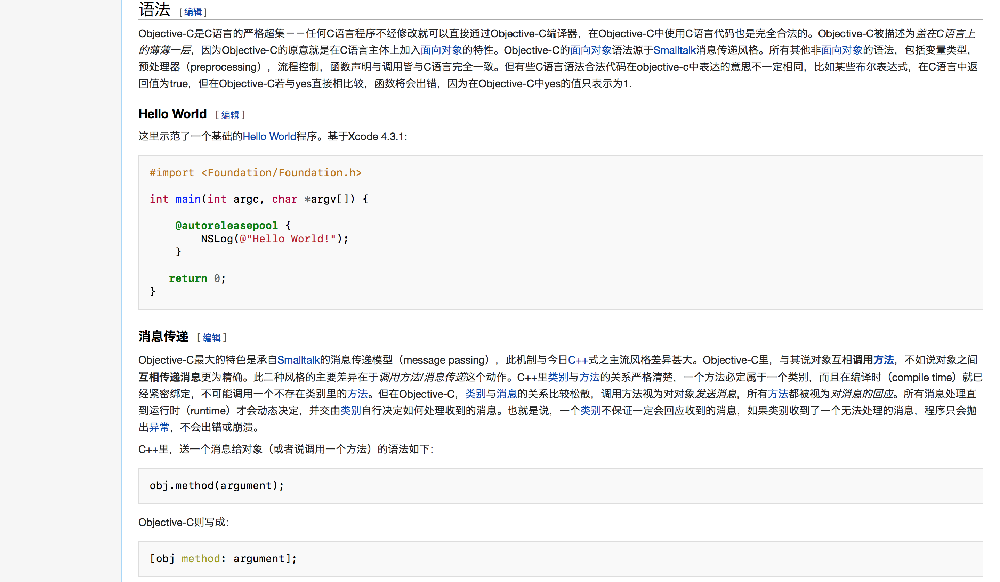
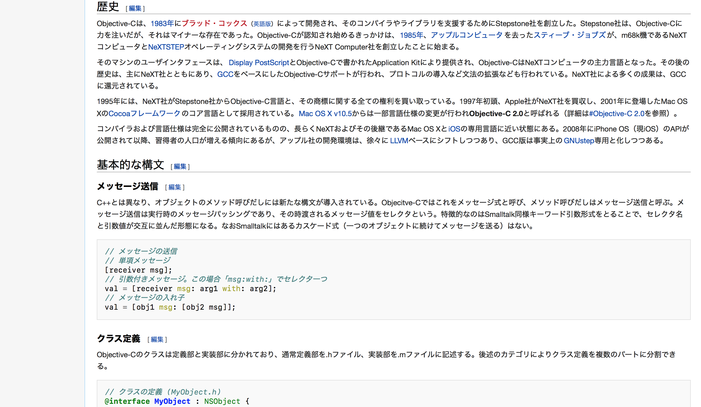

# Neo-Grotesque
Neo-Grotesque is a term of typeface, which described a modern design consists of a direct evolution of grotesque types. One of the most famous typeface is Helvetica – The one we could find on the logo of Jeep, 3M, Oral-B, The North Face, American Airlines (old logo), Microsoft (old logo), etc. This CSS style is based on Helvetica (or Helvetica Neue), which means if you have Helvetica or Helvetica Neue installed in your computer (Note that OS X is pre-installed Helvetica and Helvetica Neue), the browser will render the Wikipedia better. On pan-CJK side, it will use Hiragino families (Hiragino Kaku Gothic Pro for Japanese, Hiragino Sans GB for Simplified Chinese) first (also pre-installed in OS X), and then Noto Sans CJK – a free font family designed by Google Inc. and Adobe Systems Incorporated. After these settings, Windows-oriented setting follows. Microsoft Yahei is the UI font of Simplified Chinese version of Windows Vista and its successors, a.k.a Windows 7, Windows 8, Windows 8.1 and Windows 10 in customer market. The last two fallbacks are Heiti SC, the default font of Simplified Chinese version of iOS, and `sans-serif`, if you are not using operation systems mentioned above, your browser will determine by default. Note that these information I given above is the basic knowledge of typeface and operating system, which implies you may have Hiragino families in Windows or Linux. If you do it will always render Wikipedia with the order I mentioned above. I personally suggest you that install Noto Sans CJK to your Windows and Linux computer to obtain better user experience.

新歌德体是字体中的一种术语，用来描述现代化的歌德体设计；在新歌德体风格中，最有名的莫过是 Helvetica ——在很多商标中都能找到它的身影：吉普、3M、欧乐-B、The North Face、美国航空（旧商标）以及微软（旧商标）等。本 CSS 样式基于 Helvetica （或 Helvetica Neue）设计，这意味着如果你的电脑中已经安装了 Helvetica 或者 Helvetica Neue（OS X 已经预置），浏览器将会把维基百科渲染地更完美。在汉字部分，本样式优先使用冬青黑体家族（日语：ヒラギノ角ゴシック体 简体中文：冬青黑体简体中文，都在 OS X 中预置），然后为思源黑体——一个免费的汉字圈字体，由 Google Inc. 以及 Adobe Systems Incorporated 联合设计。随后是针对 Windows 的优化，微软雅黑是自 Windows Vista 之后的简体中文版 Windows 的 UI 字体。最后为针对简体中文 iOS 的优化，如果你的操作系统不在上述之列，即会渲染浏览器默认字体 `sans-serif`。但是请注意，上面我提到的均是关于字体以及操作系统的基本知识，这意味着你的 Windows 或 Linux 电脑一样可以安装冬青黑体家族；字体总是按照我提到的顺序依次被渲染。我个人建议在你的 Windows 和 Linux 电脑中安装免费的思源黑体以获得更佳的用户体验。

## Noto Sans CJK
To get Noto Sans CJK by click <a href="https://www.google.com/get/noto/help/cjk/" target="_blank">__here__</a>. You could download single language package (Simplified Chinese, Traditional Chinese, Japanese, Korean), all-in-one CJK super OTC package, or all-in-one CJK OTC package if your computer supported. Read the instruction by Google carefully.  
__If you are experiencing network control, or you cannot visit the link above, please submit an <a href="https://github.com/starkshaw/wikipedia-stylesheets/issues" target="_blank">issue</a> and I will update the certain package you mentioned to this repository.__

点击<a href="https://www.google.com/get/noto/help/cjk/" target="_blank">__这里__</a>获取思源黑体。你可以根据你的电脑的支持情况，选择下载单一语言包（简体中文、繁体中文、日文、朝鲜文），抑或是四合一 Super OTC 包或者四合一 OTC 包。请谨慎阅读 Google 列出的使用说明。  
__如果你正受到网络管制，或者无法访问上述链接，请提交<a href="https://github.com/starkshaw/wikipedia-stylesheets/issues" target="_blank">事件</a>，我将会向本仓库上传你提到的字体包。__

## Source Code Pro
Source Code Pro is an open source monospaced sans serif font family designed by Adobe Inc. It is ideally used for display formatted code, such as programming code, etc. To get Source Code Pro, please go to their GitHub repository by click <a href="https://github.com/adobe-fonts/source-code-pro" target="_blank">__here__</a>.

Source Code Pro 是一个由 Adobe Inc. 开发的开源的等宽无衬线字体。对于网页中的代码——例如编程代码——具有比较理想的显示效果。点击<a href="https://github.com/adobe-fonts/source-code-pro" target="_blank">__这里__</a>访问他们的 GitHub 软件仓库并获得 Source Code Pro。

## Styles / 样式
- [Neo-Grotesque_zh_CN_Vector.css](Neo-Grotesque_zh_CN_Vector.css)  
  This style is designed for skin “Vector” of Simplified Chinese Wikipedia. You may also use it in Traditional Chinese but not tested.  
  用于简体中文版本的维基百科皮肤 “Vector”，你也可以用于繁体中文版但是这并未经过我的测试。  
  __Example / 示例__  
  
- [Neo-Grotesque_JP_Vector.css](Neo-Grotesque_JP_Vector.css)  
  This style is designed for skin “Vector” of Japanese Wikipedia.  
  用于日文版本的维基百科皮肤 “Vector”。  
  __Example / 示例__  
  
  
  __All examples are captured in Safari 8.0.8 on OS X Yosemite 10.10.5.__  
  __所有示例都截取自运行在 OS X Yosemite 10.10.5 的 Safari 8.0.8。__
